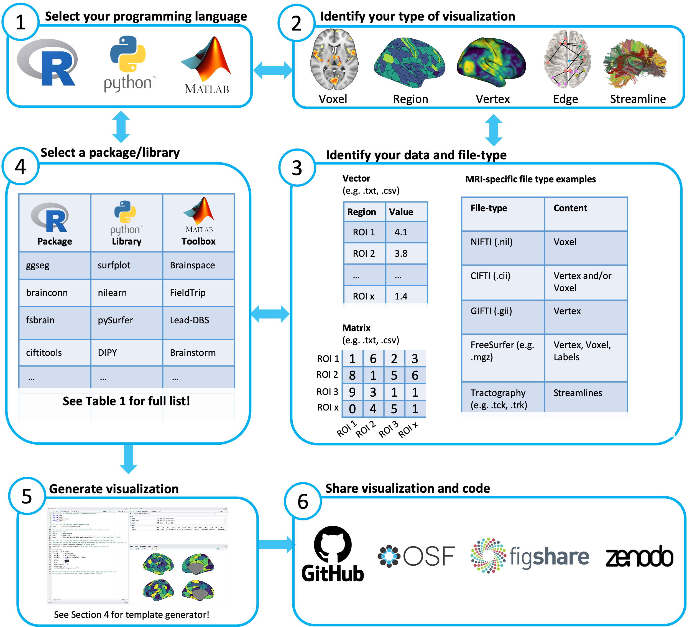

```{r setup, include=FALSE}
knitr::opts_chunk$set(echo = TRUE, warning = F, message = F)
```

# Introduction

The visualization of neuroimaging data is one of the primary ways in which we evaluate data quality, interpret results, and communicate findings. These visualizations are commonly produced using graphical user interface-based (GUI) tools where individual images are opened and, within each instance, display settings are manually changed until the desired output is reached. In large part, the choice to use GUI-based software has been driven by a perception of convenience, flexibility, and accessibility. However, there now exist code-based software packages that are well-documented and do not require high-level and comprehensive knowledge of programming, making them accessible to the neuroimaging community. These tools are flexible and allow for the generation of reproducible, high-quality, and publication-ready brain visualizations in only a few lines of code, especially within the R, Python and MATLAB environments. Here, we first discuss the rationale for the widespread adoption of code-generated visualizations by highlighting major advantages in replicability, flexibility, and integration over GUI based tools. We then provide a practical guide outlining the steps required to make code-based brain visualizations and provide a web-app (<https://sidchop.shinyapps.io/braincode/>; see Section\@ref(brain-code-a-web-app-for-generating-code-templates-for-brain-visualizations)) that can generate simple code-templates as starting points for these visualizations. We also present a comprehensive table of tools currently available for programmatic brain visualizations (Table 1) and provide instructive examples of visualizations and associated code as a point of reference (Figure 2-3). The focus of this guide is on human brain magnetic resonance imaging (MRI) data, but many of the principles discussed and tools provided will equally apply to visualizing data from other organs and imaging modalities such as EEG, MEG, PET and CT.

# Benefits of learning to generate code-based brain visualizations

## Replicability

In recent years, there have been multiple large-scale efforts empirically demonstrating the lack of reproducibility of findings from neuroimaging data (Poldrack et al., 2017). One common solution proposed for achieving robust and reliable discoveries has been to encourage scientific output which can be transparently evaluated and independently replicated. In practice, this typically entails openly sharing detailed methods, materials, code, and data. While there is a trend towards increasing transparency and code sharing of neuroimaging analyses, the sharing of code used to generate figures such as brain renderings and spatial maps has been relatively neglected. This gap in reproducibility is partly driven by the fact that brain figures are often created using a manual process that involves tinkering with sliders, buttons, and overlays on a GUI, concluding with a screenshot and sometimes beautification in image processing software like Illustrator, Photoshop or Inkscape. Such a process inherently makes neuroimaging visualizations difficult, if not impossible to replicate at times, even by the authors themselves.

Code used for data visualization should reflect a core feature of open science. Given that brain figures regularly form the centerpiece of interpretation within papers, conference presentations, or news reports, making sure they can be reliably regenerated is crucial for knowledge generation and dissemination. By writing and sharing code used to generate brain visualizations, a direct and traceable link is established between the underlying data and the corresponding scientific figure. While this code doesn't necessarily reflect the validity or accuracy of the scientific finding, it allows for reproducibility, instilling transparency and robustness, while demonstrating a desire to further scientific knowledge. Some even consider publishing figures which cannot be replicated as closer to advertising, rather than science (Steel, 2013).

Notably, some GUI-based tools have historically offered command-line access to generate replicable visualizations (e.g., FreeView, FSLeyes, surfice), making their use potentially equally replicable to purely code-based tools. Use of these specialized command-line interfaces can provide a useful middle ground for those who have little experience with coding environments. Nonetheless, these interfaces often still have a learning curve, but can lack other advantages, such as iteration, provided by the preferred programming environment (see Sections \@ref(flexibility-and-scalability) and \@ref(integrative-and-interactive-reporting)). Likewise, other GUI-based tools offer replicability in the form of automatically generated batch scripts (text files containing lines of specialized commands that can be re-executed) or in-built terminals, which can be idiosyncratic and may lack documentation to make them easily usable or replicable by those not familiar with the specific software.

## Flexibility and scalability

Being able to exactly replicate a figures via code has marked advantages beyond open science practices. In particular, the ability to reprogram inputs (such as statistical maps) and settings (such as color schemes, thresholds, and visual orientations) can streamline the entire scientific workflow. Changing inputs and settings via code allows for the easy production of multiple figures, such as those resulting from multiple analyses that require similar visualizations. A simple for-loop or plotting function with altered input and/or settings-of-interest can be a powerful method for exploring visualization options or rapidly creating multi-panel figures. Likewise, an arduous request from a reviewer or collaborator to alter the image processing or analysis becomes less of a burden when the associated figures can be re-generated with a few lines of code, as opposed to re-pasting and re-illustrating them manually. Having a code-base with modifiable inputs can mean that the generation of visualizations requires less time, energy and effort than image and instance specific GUI-based generation. This also makes it easier to generate consistent figures across subsequent projects. Keep in mind that the gains of writing code for figures are cumulative, and in addition to improving programming skills, one can build a code-base for figure generation that can continue to be reused and shared throughout a scientific career.

Precise controls via code over visualization settings, such as color schemes, legend placement and camera angles, can provide much greater flexibility over visualizations. Nonetheless, part of the appeal of GUI-based tools is that the presets for such settings can provide a useful starting point and reduce the decision burden on novice users. However, similar presets are often available in the form of default settings across most code-based packages, negating the need for the user to manually enter each and every choice required for creating an image. Most code-based tools also come with documentation, with R-packages on the *CRAN* or *Neuroconductor* (Muschelli et al., 2019) repositories strictly requiring detailed guidance. Recent packages have started to include detailed beginner-friendly documentation in GitHub repositories, or even entire papers (e.g., Pham, Muschelli, & Mejia, 2022; Mowinckel & Vidal-Piñeiro, 2020; Huntenburg et at., 2017; Schäfer & Ecker, 2020) that provide examples of figures that can be used as starting points or templates for new users (also see Section\@ref(brain-code-a-web-app-for-generating-code-templates-for-brain-visualizations)). As the popularity of code-sharing for figure increases, there will be a cornucopia of templates that can be used as the basis for new figures.

While brain visualizations are often thought of as the end results of analyses, they also form a vital part of quality control for imaging data. Tools to automatically detect artefacts, de-noise the data and generate derivatives are becoming more robust, but we are not yet at the stage where visualizing the data during processing is no longer necessary. Nonetheless, when working with large datasets such as Human Connectome Project (Van Essen et al., 2013) or UK BioBank (Sudlow et al., 2015), it is simply not feasible to use traditional GUI-based tools to visually examine the data. The time it takes to open a single file and achieve the desired visualization settings vastly compounds when working with large datasets. Knowing how to programmatically generate brain visualizations can allow for iteration of visualization code over each image of a large datasets making quality checks of each data processing step achievable. The visual outputs of each iteration can be complied into accessible documents which can be easily scrolled, with more advanced usage allowing for the creation of interactive HTML reports (see Section \@ref(generate-visualization)), similar to those created by standardized data processing tools like *fmriprep* (Esteban et al., 2019). Increasing capacity to conduct visual quality control on larger datasets will improve the identification of processing errors and result in more reliable and valid findings.

## Integrative and Interactive Reporting

Often in neuroimaging studies, programming languages such as R, Python and MATLAB are used for statistical analysis and generating non-brain figures, but the brain figures are outsourced to separate GUI-based tools such as *FSLeyes*, *Freeview* or *ITK-snap*. Increasingly popular software such as *R Markdown*, *Quarto* and *Jupyter Notebook* allow for the mixing of prose and code in a single script, resulting in fully reproducible and publication ready papers. By using code-based tools available within the preferred environment, brain visualizations can be directly integrated and embedded within a paper or report. For instance, a fully reproducible version of the current paper can be found on [GitHub](https://github.com/sidchop/RepoNeuroVis). Some journals that publish neuroimaging studies are moving towards allowing the submission of reproducible manuscripts, including reproducible figures (e.g. *eLife*, *Aperture Neuro*), with other journals like *F1000Research* and *GigaScience* even allowing on-demand re-running of code linked to the associated article via cloud-based platforms like *Code Ocean* (Code Ocean, 2021).

Neuroimaging data are often spatially 3D and can have multiple time points, adding a 4th dimension (e.g., functional imaging data). Thus, communicating findings or evaluating quality using static 2D slices is challenging, and may not be the best representation of the data, or the associated interpretations. While well-curated 3D renderings can help with spatial localisation (see Madan, 2015; Pernet & Madan, 2019), in the end, static images can only provide an incomplete representation of the data, and they force researchers to choose the "best" angle or slice to show, which often involves compromising one result to emphasize another. An added advantage of some of the code-based tools is the generation of 'rich' media like interactive figures or animations, which allow users to zoom, rotate and scroll through slices. Interacting with a figure in this way can improve scientific communication of findings. Linking to or even embedding these videos or interactive figures in papers can greatly enhance the communication of findings and make papers more engaging for the reader. Such rich brain visualizations lend themselves to being embedded or shared on science communication mediums beyond academic papers---such as presentations, websites and social media---all of which can promote the communication of research with peers and reach larger audiences (Li and Xie, 2020). This last point is becoming increasingly salient as promoting science on social media has become a core medium for spreading discoveries via science communication to the public (Mueller-Herbst, et al., 2020; Smith & Seitz, 2019; Huber et al., 2019), to the research community (Luc et al., 2021; Quintana, 2020a), and even a primary avenue for employment opportunities for early-career researchers (Baker, 2015; Lee, 2019). Overall, public engagement is one of the cornerstones of science, and the images we create are at the center of the process.

# Generating Code-based Visualizations

In the following sections we outline the primary steps required when generating programmatic and reproducible human brain visualizations, and provide tools and heuristics to guide this process.

## Selecting a programming language

The first step (Figure 1) in generating code-based visualization can be selecting the coding language. Three of the most popular languages are R, Python and MATLAB, all of which have many options for generating brain visualizations (see Table 1). This decision can be made based on what language the user has prior experience with, or if one of these languages was for the analysis part of a project. There can be advantages in using the same language for visualizations and analyses, as switching from analysis environment to separate visualization environment, or a GUI-based visualization software, can be a cumbersome deviation from the scientific workflow. This can make debugging errors more difficult, as the user must regularly switch program to visually examine the results of any modifications or adjustments to prior analyses. Using the brain visualization tools that already exist within a chosen programming environment can provide instant visual feedback on the impact of modifications to processing or analysis. Alternatively, the choice of programming language may be dictated by visualization and data-type required. For instance, visualizing streamlines from tractography may not be currently available in the R environment (Table 1), and therefore requires the use of Python or MATLAB. Other constraints may include limited access to proprietary software like MATLAB, which would necessitate the use of open-source options such as R, Python or Octave.

\newpage

```{r Figure1, echo=FALSE, out.height = '70%', out.width = '100%', fig.align='center'}
  
```

**Figure 1** Primary steps to generating programmatic and reproducible human brain visualizations. Each step is outlined in Each step is outlined in the corresponding sub-section of Section \@ref(generating-code-based-visualizations). \newpage

## Identify a visualization type

Neuroimaging data and its derivatives can be visualized in multiple forms, that have different associated file-types and visualization requirements (see Section \@ref(identify-input-file-format)). A brief description of more popular visualization types is provided below:

***Voxel*****.** In neuroimaging, voxels are used to represent the intensity values of a 3D scan, such as an MRI or CT scan. The voxels can be rendered in different colors to indicate different tissue types or other features of interest. For example, in functional MRI scans, voxels can be colored based on their level of activation, to show which areas of the brain are more active during a specific task. These visualizations are often displayed as either slices in axial, sagittal or coronal planes (Fig2A-B; Fig3A-B; or a 3D rendering of the whole brain. Statistical values are displayed as overlays on template anatomical images, which follow a common stereotaxic coordinate system (e.g., MNI152), or on individual-specific anatomical images.

***Vertex.*** In neuroimaging, vertices are used to create a mesh representation of a brain structure, such as the cerebral cortex or a subcortical regions. Each vertex has a set of coordinates that specify its location in 3D space and is connected to other vertices to form triangles, which make up the mesh. Vertices can be used to create a 3D visualization of the brain surface and color-coded based on different attributes such as sulcal depth, thickness, or functional activation. These visualizations are often displayed as 3D rendering of each hemisphere from medial and lateral views (Fig2C,G-H; Fig3C-D). Statistical values are displayed as overlays on template surfaces which follow a common stereotaxic coordinate system and fixed number of vertices (e.g., fsaverage; Fig2C,G; Fig3C-D), or on individual-specific surfaces that have been reconstructed using an anatomical image (Fig2H).

***Regions of Interest (ROI).*** In neuroimaging, ROIs are used to identify specific brain structures or areas that are relevant to the research question. ROIs can be defined using various methods, such as manual tracing, atlas-based parcellation, or functional activation patterns. Visualizing ROIs can be done by grouping and assigning the same statistical value or color to sets of voxels or vertices (Fig2B-C; Fig3B-C), or can be done through polygons. Polygonal brain visualizations are simple 2D or 3D shapes which graphically represent the brain or specific structures, but do not carry any additional information on spatial coordinates and only roughly estimate the shape of the brain and its structures. Each region of 2D (Fig 2D,F) and 3D (Fig 2E; Fig3E) polygon visualizations is filled in with colors indicating a region label or a statistical value.

***Edge.*** In the context of neuroimaging, an edge often represents a connection between two brain regions, which can be visualised as a straight or curved line connecting two nodes (brain regions) in a network. One common way data is organized for edge-level visualization is a matrix, often called a 'connectivity' or 'adjacency' matrix, which indexes the presence and strength of the connections between pairs of brain regions. Visualitaion tools often convert these matrices into network graphs, where the vertices represent brain regions and the edges represent the connections between those regions, and can be displayed in a variety of ways, such as overlayed on a 2D or 3D representation of the brain (Fig2I; Fig3F), with edges represented as straight lines connecting the vertices. Often, visual properties of edges and nodes can also be adjusted to convey information, such as sized or color-coded based the strength or number of connections.

***Streamlines.*** While similar to edges, streamlines are specifically used to representation of the white matter fibers in the brain and are usually an out put of applying tractography applied to diffusion-weighted MRI. Streamlines are typically visualized as curved 3D lines that connect different points of the brain and can be used to create 3D visualizations of specific white matter tracts, or all streamlines between regions. They can be color-coded based on the direction of the fibers or properties of the tract, such as myelination. These visualizations can be overlaid on voxel or vertex level anatomical brain representations to provide an anatomical reference point.

The following two figures provide examples of voxel, vertex, ROI and edge-level visualizations generated within R (Figure 2) and Python (Figure 3) using open source, well documented and beginner-friendly packages. These are not an exhaustive representation of packages available for visualizing brain data in R and Python (see Table 1). Rather, the figures aim to give the reader a sense of the many options available, and an entry point to choosing the type of brain visualization needed (also see Section\@ref(brain-code-a-web-app-for-generating-code-templates-for-brain-visualizations)). All code used to compile the figures, as well as the contents of each panel are provided in the accompanying [online repository](https://github.com/sidchop/RepoNeuroVis).

```{=tex}
\newpage
\blandscape
```
```{r Figure2, echo=FALSE, out.height = '60%', out.width = '70%', fig.align='center'}

show_fig <- function(f) # function to convert and embed svg file
  {if (knitr::is_latex_output())
  {
    output = xfun::with_ext(f, 'pdf')
    rsvg::rsvg_pdf(xfun::with_ext(f,'svg'), file=output)
  } else {
    output = xfun::with_ext(f, 'svg')
  }
  knitr::include_graphics(output)
}
show_fig("./data/R/Figure1.svg")


```

***Figure 2. Examples of brain imaging visualizations made using R.*** A) Voxel-level statistical map thresholded and overlaid over a T1-weighted template image, with a single axial slice shown. Made using the the `ortho2` function from the `neurobase` package. B) A voxel-level cortical parcellation overlaid on a individual T1-weighted image, shown in 9-slice axial orientation. Made using the `overlay` function from the `neurobase` package. C) A CIFTI format surface ROI atlas with a corresponding statistic assigned to each region, with both hemispheres displayed on a inflated template surface in lateral view. Made using the `view_xifti_surface` from the `ciftiTools` package. D) A coronal cross-sectional rendering of subcortical structures where a value has been assigned to each region. Made using the `aseg` atlas from the `ggseg` package. E) A 3D rendering of 9 bilateral subcortical regions where a value has been assigned to each region. Made using the `aseg` atlas from the `ggseg3d` package. F) Medial and lateral views of a ROI atlas displayed on inflated cortical surface where a value has been assigned to each region. Made using the `glasser` atlas from the `ggsegGlasser` package, which was plotted using `ggseg`. G) Lateral view of a CIFTI format vertex-level data displayed on a inflated template surface. Made using the `view_xifti_surface` function from the `ciftiTools` package. H) Medial and lateral views of vertex-level data displayed on a individuals white matter surface. Made using the `vis.subject.morph.standard` function from the `fsbrain` package. I) A weighted and undirected graph plotted on top, left and front views of a schematic outline of a brain in MNI coordinate space. Made using the `brainconn` function from the `brainconn` package. All code used to compile this figure, as well as the contents of each panel are provided in an accompanying [online repository](https://github.com/sidchop/RepoNeuroVis).

\elandscape

```{=tex}
\newpage
\blandscape
```
```{r Figure3, echo=FALSE, out.height = '60%', out.width = '85%', fig.align='center', dev='cairo_pdf'}
knitr::include_graphics("./data/python/Figure2.pdf")
```

***Figure 3. Examples of brain imaging visualizations made using Python.*** A) Voxel-based statistical map thresholded and overlaid over a T1-weighted template data, with a single axial slice shown. Made using the `plotting.plot_stat_map` function from `nilearn`. B) Voxel-level cortical parcellation overlaid on T1-weighted MRI data shown in four axial slices. Made using `plotting.plot_roi` function from `nilearn`. C) Medial and lateral views of a cortex-wide ROI atlas, displayed on an inflated template surface where a statistical value has been randomly assigned to each ROI. Made using `Plot` function from `surfplot`. D) Lateral and medial views of vertex-level data displayed in a 3D rendering on an individual's white matter surface. Made using plotting.view_surf function in from `nilearn`. 3D rendering of 16 subcortical structures from the the Deiskan-Killiany atlas, where a statistical value has been randomly assigned to each region. Made using the `plot_subcortical` function from the `ENIGMA TOOLBOX`. A weighted and undirected graph plotted on front, right, and top views of a schematic outline of a brain in MNI coordinate space. Made using plotting.plot_connectome function in `nilearn`. All code used to generate the contents of each panel, and compile this figure are provided in an accompanying [online repository](https://github.com/sidchop/RepoNeuroVis).

\elandscape

## Identify input file-formats

Neuroimaging data and its derivatives come in many different file formats, and code-based visualization packages have specific formats they are designed to work with. Table 1 provides a key, listing which data-type can be used as inputs for each package. Some of the most common MRI file-formats used as inputs for visualizations are briefly described below:

***Plain text format.*** The simplest input formats are a scalar, vector, and matrix, which represent a single data-point, one-dimensional array of data (e.g., a single column or row), and a two-dimensional array of data (e.g. multiple columns or rows), respectively. These data are often stored in plain text formats such as `.txt`, `.csv`, and `.tsv` and can be generated by neuroimaging analyses software such as SPM, FSL or FreeSurfer. These files can also contain rows and columns of region names and/or spatial coordinates. All programming languages have functions to read these plain text formats into the coding environment. These formats are often used in region-level visualizations, where groups of voxels or vertices share the same value or color (Fig2B-F; Fig3B-E), or in edge-level visualizations, where a matrix is used to identify regions are connected by an edge (Fig2F; Fig3F).

***NIfTI*****.** NIfTI (`.nii`) files store 3D or 4D image data, which is often a matrix of voxel intensities or a series of 3D matrices for 4D data such as fMRI and dMRI. The image data is stored as a 3D matrix of voxel intensities, and the header contains additional information, such as the image dimensions and voxel size. Additional information such as the subjects demographics and scanner parameters can also be stored in the header in the form of metadata.

***GIfTI.*** GIFTI (`.gii`) is an extension of the NIFTI format, which stores data in a surface-based format, where data is represented as a set of vertices, edges, and faces that define a surface mesh. The format also includes support for storing data such as curvature, thickness, and functional activity maps on the surface mesh. Often `.gii` file names will have a pre-indicator of what information the file contains, such as `.surf.gii`, which would contain only vertices, edges and faces to define a surface mesh. Or `.func.gii` files which contain data values for every vertex, which are essentially data arrays whose indices correspond to a surface file and need a matching surface file to know where in the brain to assign the data values. GIFTI files can also store multiple surfaces in a single file, and can include information about the topology of the surfaces, such as the number of vertices, edges, and faces. Additional metadata can also be stored in the header.

***CIfTI.*** CIFTI (`.cii`) files can store data from both surface-based and volume-based neuroimaging analyses, combining aspects of NIFTI and GIFTI files. For surface-based data, the file contains vertex coordinates, and data values at each vertex. For volume-based data, the file contains a 3D matrix of voxel intensities. Often this datatype is used to represent the cortex as vertices, and subcortical structures as voxels. CIFTI files can be divided into three main types: `.dtseries` (store time-series data, such as fMRI data), `.dtscalar` (store scalar data, such as thickness or curvature maps), and `.dtlabel` (store label data, such as parcellations of the brain). CIFTI files can also include fields with additional metadata such as surface and volume registration information.

***FreeSurfer.*** FreeSurfer is a commonly used image processing and analysis software that comes with a variety of proprietary formats to store outputs. The primary format is `.mgh` and its compressed version `.mgz`, which like `.nii` files, genrally stores voxel-level data. Vertex-level data is stored in multiple formats such as `.pial`, `.white`, and `.inflated`. FreeSurfer also uses `.label` files to store a list of vertices and associated labels for each brain structure, and `.annot` files FreeSurfer store annotation information such as vertices, labels and color information that can be overlaid on the surface reconstruction.

***Tractography.*** Commonly used tractography file formats include `.trk` and `.tck` developed by the TrackVis and MRtrix software packages, respectively. Both formats store coordinates for streamlines as a series of 3D points, with each point represented by its x, y, and z coordinates, as well as a tract header with the number of points in the tract, the properties of the tract (e.g., mean diffusivity, fractional anisotropy), as well as the starting and ending indices of the tract.

Critically, many of these datatypes are interchangeable, and can be converted between each other. There are many ways to convert between format, for instance, the Connectome Workbench (Marcus et al., 2011), and corresponding R-packages like `ciftitools` (Pham, Muschelli, & Mejia, 2022) allow for conversion between NIFTI, CIFTI and GIFTI formats. FreeSurfer functions such as `mri_convert`, NiBabel (Brett et al., 2023) library in *Python* and `fsbrain` (Schäfer & Ecker, 2020) in R, all allow for conversion between the propriety formats and open-source NIFTI, CIFTI and GIFTI formats. Therefore, if a given file format to is not compatible with a visualization package, library, or toolbox, the user may be able to convert data into the desired format. Although, it is important to visualize and validate data after converting between data-structures, to ensure the data have not been misinterpreted, and also to be aware that unintended consequences of mapping between 2D surface and 3D volume formats may arise (e.g., Ciantar et al., 2022).

## Select a package, library or toolbox

The previous steps of deciding a programming environment, visualization type and input data-type will help users decide which package, library or toolbox is the right choice. Table 1 provides a list of tools in R, Python and MATLAB, characterized by whether they are able to generate voxel, vertex, ROI, edge and streamline based visualizations. While each tool may contain the ability to generate code-based visualizations, some tools are more beginner-friendly and better documented than others. Usually, this is the case for tools that are specifically designed for brain data visualization, as opposed to tools which are designed for brain data analysis but also provide some limited visualization functionality. Some examples of well documented and beginner-friendly tools have been provided via a code template generator (see Section \@ref(brain-code-a-web-app-for-generating-code-templates-for-brain-visualizations)).

An important consideration when selecting a tool can be whether it can generate publication-ready plots. Publication-ready plots are high resolution, labelled, contain all color bars and legends, and require no additional manual image manipulation. While all tools listed in Table 1 contain some of these features, some tools enable more precise control over publication-ready features such as legend placement, color bar placement, annotations, labeling, and multi-panel figures. These tools usually produce visualization that rely on mainstream general purpose plotting engines such as `ggplot` in R and `matplotlib` in Python. This allows users to leverage many additional features to make their brain visualizations publication ready. For example, the `ggseg` and `ggsed3d` packages (Mowinckel & Vidal-Piñeiro, 2020) in R generate plots compatible with the widely-used grammar of graphics (i.e., `ggplot2`) and `plotly` engines, respectively. Similarly, the `Nilearn` library in python allows plots to be generated using `matplotlib` or `plotly` engines. We note that many of the others listed in Table 1 also rely on common plotting engines to generate visualizations.

\newpage

**Table1 Examples of code-based neuroimaging visualizations tools that can be accessed directly within R, MATLAB and Python environments.**

|                                                                                                         | Voxel               | Vertex             | ROI                   | Edge             | Streamlines    |
|:-----------|:-----------|:-----------|:-----------|:-----------|:-----------|
| **R**                                                                                                   |                     |                    |                       |                  |                |
|   [ANTsR](https://antsx.github.io/ANTsR/articles/ANTsR.html)                                            | ***+^2^***          | ***+^2^***         | ***+^2^***            | ***+^1^***       |                |
|   [brainconn](https://github.com/sidchop/brainconn)                                                     |                     |                    |                       | ***+^1^***       |                |
|   [brainR](https://github.com/muschellij2/brainR)                                                       | ***+^2,6,7^***      |                    | ***+^6,7^***          |                  |                |
|   [ciftitools](https://github.com/mandymejia/ciftiTools)                                                | ***+^2,3^***        | ***+^2,3^***       | ***+\*^,2,3^***       |                  |                |
|   [fsbrain](https://github.com/dfsp-spirit/fsbrain)                                                     | ***+^4^***          | ***+^3,4^***       | ***+\*^,6,3,4^***     |                  |                |
|   [ggseg](https://github.com/ggseg/ggseg)                                                               |                     |                    | ***+^1,4^***          |                  |                |
|   [neurobase](https://github.com/muschellij2/neurobase)                                                 | ***+^2^***          |                    |                       |                  |                |
|   [oro.nifti](https://github.com/muschellij2/oro.nifti)                                                 | ***+^2^***          |                    |                       |                  |                |
| **Python**                                                                                              |                     |                    |                       |                  |                |
|   [ANTsPy](https://github.com/ANTsX/ANTsPy)                                                             | ***+^2^***          | ***+^2^***         | ***+^2^***            |                  |                |
|   [brainiak](https://github.com/brainiak/brainiak)                                                      | ***+^2^***          |                    |                       |                  |                |
|   [Brainplotlib](https://github.com/feilong/brainplotlib)                                               |                     | ***+^1,11^***      | ***+\*^,1,11^***      |                  |                |
|   [Brainspace](https://github.com/MICA-MNI/BrainSpace)/[surfplot](https://github.com/danjgale/surfplot) |                     | ***+^3,4,6,7.8^*** | ***+\*^,3,4,6,7,8^*** |                  |                |
|   [DIPY](https://github.com/dipy/dipy)                                                                  | ***+^2^***          |                    |                       |                  | ***+^5,9^***   |
|   [ENIGMA TOOLBOX](https://github.com/MICA-MNI/ENIGMA)                                                  |                     |                    | ***+^1,3,4,6,8^***    |                  |                |
|   [FSLeyes](https://github.com/pauldmccarthy/fsleyes)                                                   | ***+^2,3,4^***      | ***+^2,3,4^***     | ***+^2,3,4^***        |                  | ***+^2,5^***   |
|   [ggseg](https://github.com/ggseg/python-ggseg)                                                        |                     |                    | ***+^1,4^***          |                  |                |
|   [graphpype](https://neuropycon.github.io/graphpype/)                                                  |                     |                    |                       | ***+^1,10,11^*** |                |
|   [MMVT](https://github.com/pelednoam/mmvt)                                                             |                     | ***+2,4***         | ***+2,4***            | ***+^1,10,11^*** |                |
|   [MNE](https://github.com/mne-tools/mne-python)                                                        | ***+^2,4^***        | ***+^4^***         | ***+^4^***            |                  |                |
|   [mrivis](https://github.com/raamana/mrivis)                                                           | ***+^2^***          |                    |                       |                  |                |
|   [NaNSlice](https://github.com/spinicist/nanslice)                                                     | ***+^2^***          |                    |                       |                  |                |
|   [netneurotools](https://github.com/netneurolab/netneurotools)                                         |                     | ***+^4^***         | ***+\*^,3^***         |                  |                |
|   [netplotbrain](https://github.com/wiheto/netplotbrain)                                                |                     |                    | ***+^1,2^***          | ***+^1,11^***    |                |
|   [nilearn](https://github.com/nilearn/nilearn)                                                         | ***+^2^***          | ***+^2,3^***       | ***+^2,3^***          | ***+^1,11^***    |                |
|   [niwidget](https://github.com/nipy/niwidgets)                                                         | ***+^2,3,4^***      | ***+^2,3,4^***     |                       |                  | ***+^5^***     |
|   [Pycortex](https://github.com/gallantlab/pycortex)                                                    | ***+^8,11,12^***    | ***+^4,8,11,12^*** | ***+\*^,4,8,11,12^*** |                  |                |
|   [pySurfer](https://pysurfer.github.io/)                                                               |                     | ***+^4^***         | ***+\*^,4^***         |                  |                |
|   [surfice](https://github.com/neurolabusc/surf-ice)                                                    | ***+^2,3,4^***      | ***+^2,3,4^***     | ***+^2,3,4,6^***      | ***+^1,4,6^***   | ***+^4,5,6^*** |
|   [Visbrain](https://github.com/EtienneCmb/visbrain)                                                    | ***+^1,2,3,6^***    | ***+^1,2,3,6^***   | ***+^1,2,3,6^***      | ***+^1,2,3,6^*** |                |
| **MATLAB**                                                                                              |                     |                    |                       |                  |                |
|   [BrainNetViewer](https://www.nitrc.org/projects/bnv/)                                                 | ***+^2,3,4,6,13^*** |                    | ***+^2,3,4,6,13^***   | ***+^1,10^***    |                |
|   [Brainspace](https://github.com/MICA-MNI/BrainSpace)                                                  |                     | ***+^3,4,6,7,8^*** | ***+\*^,3,4,6,7,8^*** |                  |                |
|   [Brainstorm](https://github.com/brainstorm-tools/brainstorm3)                                         | ***+^2^***          | ***+^4,6^***       | ***+^3,4,6^***        |                  |                |
|   [bspmview](https://www.bobspunt.com/software/bspmview/)                                               | ***+^2,13^***       |                    | ***+^2,13^***         |                  |                |
|   [CandlabCore](https://github.com/canlab/CanlabCore)                                                   | ***+^2,10,13^***    |                    | ***+^2,10,13^***      |                  |                |
|   [ECoG/fMRI Vis toolbox](https://github.com/Immiora/matlab-ecog-visualization)                         |                     | ***+^10^***        | ***+\*^,10^***        |                  |                |
|   [ENIGMA TOOLBOX](https://github.com/MICA-MNI/ENIGMA)                                                  |                     |                    | ***+^1,10^***         |                  |                |
|   [FieldTrip](https://www.fieldtriptoolbox.org/)                                                        | ***+^2^***          | ***+^10^***        |                       |                  |                |
|   [Lead-DBS](https://www.lead-dbs.org/)                                                                 | ***+^2^***          |                    | ***+^2,3,4^***        |                  |                |
|   [mni2fs](https://github.com/dprice80/mni2fs)                                                          |                     | ***+^2,3^***       |                       |                  |                |
|   [mrtools](https://github.com/justingardner/mrTools)                                                   | ***+^2^***          | ***+^4,12^***      | ***+\*^,2,4,12^***    |                  |                |
|   [plotSurfaceROIBoundary](https://github.com/StuartJO/plotSurfaceROIBoundary)                          |                     | ***+^4,10^***      | ***+\*^,4,10^***      |                  |                |
|   [Vistasoft](http://web.stanford.edu/group/vista/cgi-bin/wiki/index.php/Visualization)                 | ***+^2^***          | ***+^2^***         | ***+^2^***            |                  | ***+^10^***    |

Note: The tools listed contain functionality required to generate (at least close-to) publication-ready neuroimaging figures via user-entered code within R, MATLAB and Python environments. An interactive version of this table can be found here: <https://sidchop.shinyapps.io/braincode_selector/>. This list does not include cross-platform general purpose visualization software. **1** = .txt/.csv (scalar, vector, matrix as input); **2** = .nii/.nii.gz (nifti as input); **3** = .cii/.gii (cifti or gifti files as input, includes any subtypes e.g. dlabel, dtseries, .surf); **4** = FreeSurfer formats as input, including .mgz, .annot, .label, .curv, .wm etc); **5** = .trk/.tck (tractograms as input); **6** = .obj (3D object format); **7** = .ply (3D polygon format); **8** = .vtk (Visualization Toolkit format); **9** = .fib (Legacy vtk format); **10** = .mat (MATLAB format); 11 = .npy/.npz (Python numpy format); **12** = .off (object file format); ***\**** = Cortex only.

\newpage

## Generate Visualization

Popular integrated development environments (IDE) such as *RStudio*, *Visual Studio* and *Spyder*, come with the inbuilt ability to display and update figures as the code is executed. The resulting visualization can be shared or embedded in papers in multiple different ways, with differing levels of replicability (see Section \@ref(flexibility-and-scalability), interactivity (see Section \@ref(integrative-and-interactive-reporting)) and visual quality. One common way to share visualizations is to export it as a image raster format such as `.png`, `.tiff` or `.jpeg`, where images appear as a grid of pixels and each pixel in the grid contains information about the color and intensity of that specific point in the image. These formats are resolution dependent, and will become pixelated and difficult to parse when enlarged. Vector formats, such a `.svg`, `.eps` and `.pdf` on the other hand can be scaled larger or smaller without losing quality. While all coding environments provide ways to export visualizations into raster formats, exporting using vector formats, while visually superior, depends on the specific tool. Generally, only visualization tools that rely on mainstream general purpose plotting engines such as `ggplot` in R and `matplotlib` in Python allow for images to be exported as true vector formats.

Increasingly popular software such as *R Markdown*, *Quarto*, *Jupyter Notebook*, and *Google Collab* allow for the creation of dynamic documents that combine code, text, and visualizations in a single file. This makes it easier to document workflows and share complete analyses, enhancing both collaboration and reproducibility. Including the code used to generate figures and other results alongside well formatted text-based explanations (see Section \@ref(integrative-and-interactive-reporting)), enables the user and others to replicate work accurately. These tools also offer a wide range of output formats, including PDF, HTML, Word and LaTeX. This versatility enables the generation of polished reports, presentations, manuscripts, or even interactive dashboards, all from a single source file. Currently, while *R Markdown* is primarily associated with R and *Google Collab* with Python, Jupyter Notebook and Quarto support a broader range of programming languages, including Python, Julia, R, and others.

## Share visualization code

Images that are generated using code can then be inserted into outputs such as a manuscript and the associated code can be included in supplementary materials. While this is the simplest way to share visualizations and code, it may not be as accessible as uploading code to dedicated code-sharing and version control platforms such as [GitHub](https://github.com/) or [GitLab](https://about.gitlab.com/). These services are currently widely used and allow for code to maintain formatting, version control and search functions.

Alternate options are widely used general-purpose research data repositories, such as [Open Science Framework](https://osf.io/), [Zenodo](https://zenodo.org/) or [FigShare](https://figshare.com/), that enable researchers to publish and share their datasets, software, code and other research outputs at no cost. One advantage of these platforms is that users can assign a Digital Object Identifier (DOI) number to shared materials, making them independently citable and enhancing visibility since DOIs are indexed by various repositories and search engines. Some platforms even provide usage metrics, enabling users to gather insight on how often code and materials are accessed, cited or reused by others, which can be valuable information for evaluating the impact and reach of work.

An important consideration when both writing and sharing code for figure generation is the long-term preservation of code and resistance to software collapse. While a discussion of code and software preservation is outside the scope of the current paper, readers can refer to Hinsen (2019), and initiatives such as [Software Heritage](https://www.softwareheritage.org/) which aim to preserve and archive all the software source code available worldwide, ensuring that valuable software source code is not lost over time.

In addition to the platform used, how accessible the code is to both the user and others depends on how clearly the code is written, formatted and commented. While guidance on proper organization of the neuroimaging visualization code is beyond the scope of this guide, we point readers to other practical guides on this topic (Van Vliet, 2020; Gorgolewski & Poldrack, 2016).

While sharing code is necessary for replicability, it is often not sufficient, as the underlying data source being visualized may be needed for the code to function correctly. While many of the same sharing platforms listed above can also host source data alongside code, there now exist specialized platforms, such as [OpenNeuro](https://openneuro.org/) and [NeuroVault](https://neurovault.org/), which to allow sharing neuroimaging specific datasets, such as those containing NIFTI and CIFTI images. If the source data for visualizations cannot be shared, synthetic data can also be generated and provided alongside the code be provided (Quintana, 2020).

# Brain-Code: A web-app for generating code templates for brain visualizations

To assist new users transition into generating code-based brain visualizations we have developed a web-app (<https://sidchop.shinyapps.io/braincode/>) which allows for interactive generation of code-templates for beginner friendly libraries/packages in R and Python. In the web-app, users can select R or Python as their coding environment, and choose between voxel, ROI, vertex, and edge-level visualizations. They can then manually adjust a limited set of visualization setting, such as color-scales and view, and are provided with a reactive code-template which can be copied and then used within their respective programming environment. The provided code templates require users to customize the code, such as alter file-paths. The available settings have been purposefully limited to allow users to explore and fine-tune additional visualization options within their own programming environment. The code-template also contains links and prompts to more detailed documentation, alternate packages/libraries and tutorials which allow for more complex and publication-ready brain visualizations. Users can download bundled version of the web-apps via a [GitHub](https://github.com/sidchop/RepoNeuroVis) repository.

\newpage

```{r Figure4, echo=FALSE, out.height = '70%', out.width = '100%', fig.align='center'}
  
```

**Figure 4.** Interface for [BrainCode](https://sidchop.shinyapps.io/braincode/) web-app which generates simple code-based templates for brain visualizations. (1) Select a programming environment (R or Python). (2) Select a visualization type (Voxel, Region, Vertex and Edge). There is also a Frequent Asked Questions tab to aid users. (3) Manually adjust limited visualization settings and examine how it reactively changes the visualization (4) and code template (5). (5) Copy the code template into selected programming environment, change file-paths to data and explore other visualization settings offered by the functions. \newpage

# Limitations and Functionality Gaps

While many code-based tools are well documented and do not require a strong knowledge of programming, there can still be a steep learning curve for new users, compared to using a GUI. We hope that the provided template generator gives jumping-off point for new users. This is especially true for the purpose of a publication-ready figure, where fine adjustments to visual features such as legend placement, font size and multi-panel figure positioning may be needed. While most code-based tools offer some control over these finer steps, there are differences between them in feature availability and usability, with tools that use established graphic engines such as `ggplot2`, `matplotlib` and `plotly` providing the most versatile and well-documented features for visual auxiliary. Relatedly, while some interactive image viewers can be opened within an integrated development environment like R-Studio (e.g., Muschelli, 2016), for quick and interactive viewing of single images, in this context, GUI tool can be faster and more practical.

Often cerebellar and brain-stem regions are not well represented in software (e.g., Figure 2-3), potentially mirroring the cortico-centric sentiment that has prevailed in human neuroimaging research (Chin, Chang, & Holmes, 2022). Likewise, custom non-cortical atlases such as non-standard subcortical atlas schemes are not yet straightforward, and usually require multiple functions and packages to visualize. Visualizing these structures often requires chaining together multiple GUI-based tools (see Madan, 2015). Alternatively users can convert neuroimaging specific file-formats into domain general visualization or polygon formats, such as `.vtk`, `.ply` or `.obj`, which can be read, manipulated and visualized using general purpose code-based tools. Examples of such tools include PyVista and Mayavi in Python and `rayshader` and `plotly` in R. Moreover, some neuroimaging derived datatypes, such as streamlines resulting from DWI-based tractography, are still not well represented in code-based visualization tools and future development should focus on enhancing visualization capabilities using these data-types.

As can be seen in Table 1 (<https://sidchop.shinyapps.io/braincode_selector/>), there are usually multiple packages within each programming environment which can visualize each data type. While this provides choice for advanced users, it can also lead to confusion for novice users who may not be familiar with the nuanced differences between tools. While the process we have outlined, and the table and web-app we have provided will help users decide the ideal package, future work should continue to consolidate brain visualization methods into unified beginner-friendly code-based tools which rely on established and well-documented graphic engines and can plot multiple data types.

\newpage

# References

Baker M. (2015). Social media: A network boost. Nature 518: 263--265. 10.1038/nj7538-263a

Brett, Matthew, Markiewicz, Christopher J., Hanke, Michael, Côté, Marc-Alexandre, Cipollini, Ben, McCarthy, Paul, Jarecka, Dorota, Cheng, Christopher P., Halchenko, Yaroslav O., Cottaar, Michiel, Larson, Eric, Ghosh, Satrajit, Wassermann, Demian, Gerhard, Stephan, Lee, Gregory R., Wang, Hao-Ting, Kastman, Erik, Kaczmarzyk, Jakub, Guidotti, Roberto, ... freec84. (2023). nipy/nibabel: 5.0.0 (5.0.0). Zenodo. <https://doi.org/10.5281/zenodo.7516526>

Chin, R., Chang, S. W., & Holmes, A. J. (2022). Beyond cortex: The evolution of the human brain. *Psychological Review*.

Ciantar, K. G., Farrugia, C., Galdi, P., Scerri, K., Xu, T., & Bajada, C. J. (2022). Geometric effects of volume-to-surface mapping of fMRI data. *Brain Structure and Function*, *227*(7), 2457-2464. Code Ocean. (2021, October 27). Computational Research Platform on. Retrieved April 21, 2022, from <https://codeocean.com/>

David C. Van Essen, Stephen M. Smith, Deanna M. Barch, Timothy E.J. Behrens, Essa Yacoub, Kamil Ugurbil, for the WU-Minn HCP Consortium. (2013). The WU-Minn Human Connectome Project: An overview. NeuroImage 80(2013):62-79.

Esteban, O., Markiewicz, C. J., Blair, R. W., Moodie, C. A., Isik, A. I., Erramuzpe, A., ... & Gorgolewski, K. J. (2019). fMRIPrep: a robust preprocessing pipeline for functional MRI. Nature methods, 16(1), 111-116.

Gorgolewski, K. J., & Poldrack, R. A. (2016). A practical guide for improving transparency and reproducibility in neuroimaging research. PLoS biology, 14(7), e1002506.

Hinsen, K. (2019). Dealing with software collapse. *Computing in Science & Engineering*, *21*(3), 104-108.

Huber, B., Barnidge, M., Gil de Zúñiga, H., & Liu, J. (2019). Fostering public trust in science: The role of social media. *Public understanding of science*, *28*(7), 759-777.

Huntenburg, J., Abraham, A., Loula, J., Liem, F., Dadi, K., & Varoquaux, G. (2017). Loading and plotting of cortical surface representations in Nilearn. *Research Ideas and Outcomes*, *3*, e12342.

Lee J.-S. (2019). How to use Twitter to further your research career. Nature. 10.1038/d41586-019-00535-w

Li, Y., & Xie, Y. (2020). Is a picture worth a thousand words? An empirical study of image content and social media engagement. Journal of Marketing Research, 57(1), 1-19.

Luc, J. G., Archer, M. A., Arora, R. C., Bender, E. M., Blitz, A., Cooke, D. T., ... & Antonoff, M. B. (2021). Does tweeting improve citations? One-year results from the TSSMN prospective randomized trial. The Annals of thoracic surgery, 111(1), 296-300.

Madan, C. R. (2015). Creating 3D visualizations of MRI data: A brief guide. F1000Research, 4.

Marcus, D. S., Harwell, J., Olsen, T., Hodge, M., Glasser, M. F., Prior, F., \... & Van Essen, D. C. (2011). Informatics and data mining tools and strategies for the human connectome project. *Frontiers in neuroinformatics*, *5*, 4.

Mowinckel, A. M., & Vidal-Piñeiro, D. (2020). Visualization of brain statistics with R packages ggseg and ggseg3d. *Advances in Methods and Practices in Psychological Science*, *3*(4), 466-483.

Muschelli, J. (2016). *papayar*. GitHub repository. <https://github.com/muschellij2/papayar>

Muschelli, J., Gherman, A., Fortin, J. P., Avants, B., Whitcher, B., Clayden, J. D., ... & Crainiceanu, C. M. (2019). Neuroconductor: an R platform for medical imaging analysis. *Biostatistics*, *20*(2), 218-239.

Mueller-Herbst, J. M., Xenos, M. A., Scheufele, D. A., & Brossard, D. (2020). Saw it on Facebook: The role of social media in facilitating science issue awareness. *Social Media+ Society*, *6*(2), 2056305120930412.

Pernet, C., & Madan, C. R. (2019). Data visualization for inference in tomographic brain imaging.

Pham, D., Muschelli, J., & Mejia, A. (2022). ciftiTools: A package for reading, writing, visualizing, and manipulating CIFTI files in R. *NeuroImage*, 118877.

Poldrack, R. A., Baker, C. I., Durnez, J., Gorgolewski, K. J., Matthews, P. M., Munafò, M. R., ... &

Yarkoni, T. (2017). Scanning the horizon: towards transparent and reproducible neuroimaging research. Nature reviews neuroscience, 18(2), 115-126.

Quintana, D.S. (2020a). *Twitter for Scientists* [eBook edition]. Retrieved from <https://t4scientists.com/>. DOI: 10.5281/zenodo.3707741

Quintana, D. S. (2020b). A synthetic dataset primer for the biobehavioural sciences to promote reproducibility and hypothesis generation. *Elife*, *9*, e53275.

Schäfer, T., & Ecker, C. (2020). fsbrain: an R package for the visualization of structural neuroimaging data. bioRxiv.

Smith, C. N., & Seitz, H. H. (2019). Correcting misinformation about neuroscience via social media. *Science Communication*, *41*(6), 790-819.

Steel, G. (2013, September 3). Publishing research without data is simply advertising, not science. Open Knowledge Foundation. <https://blog.okfn.org/2013/09/03/publishing-research-without-data-is-simply-advertising-not-science/>

Sudlow, C., Gallacher, J., Allen, N., Beral, V., Burton, P., Danesh, J., ... & Collins, R. (2015). UK biobank: an open access resource for identifying the causes of a wide range of complex diseases of middle and old age. PLoS medicine, 12(3), e1001779.

The Comprehensive R Archive Network. (n.d.). Retrieved April 21, 2022, from <https://cran.r-project.org/>

Van Vliet, M. (2020). Seven quick tips for analysis scripts in neuroimaging. PLoS computational biology, 16(3), e1007358.

Wickham H. (2016). *ggplot2: Elegant Graphics for Data Analysis.* Springer-Verlag New York. ISBN 978-3-319-24277-4, <https://ggplot2.tidyverse.org>.

\newpage
