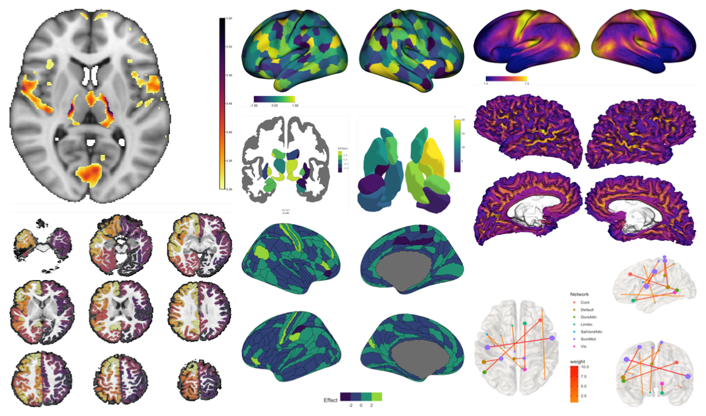
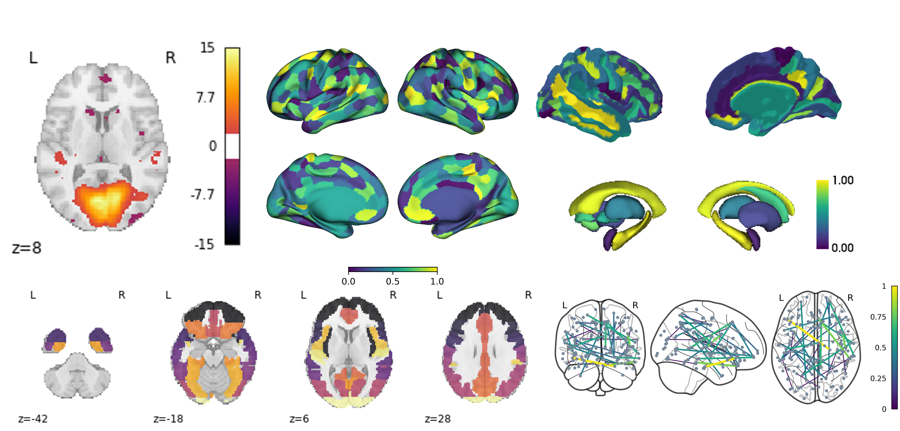

Reproducible and Programmatic Generation of Neuroimaging Visualizations
================

## Reference

**Chopra, S.**, Labache, L., Dhamala, E., Orchard, E., Holmes. A.
[Moving Towards Reproducible and Programmatic Generation of Neuroimaging
Visualizations](https://github.com/sidchop/RepoNeuroVis/blob/main/manuscript.pdf).

------------------------------------------------------------------------

## Background

Neuroimaging visualization forms the centrepiece of quality control, and
interpretation and communication of results. Often, these images and
figures are produced by manually changing settings on Graphical User
Interfaces (GUI). There now exist many well-documented code-based brain
visualisation tools that allow users to programmatically generate
publication-ready figures directly within environments such as R, Python
and MATLAB. Compared to figures generated using GUIs, programmatic tools
are more replicable, flexible, interactive, and integrated with the
scientific process. This article reviews the advantages of learning and
using programmatic neuroimaging visualization tools and provides a list
of tools across programming environments. Finally, we introduce examples
of specific R and Python tools for visualization of voxel, vertex,
region-of-interest, and edge level data.

------------------------------------------------------------------------

## Figures made in R:  

## Figures made in Python: 

------------------------------------------------------------------------

## Examples of code-based neuroimaging visualizations tools that can be accessed directly within R, MATLAB and Python environments.

|                                                                                                       | Voxel   | Vertex  | ROI       | Edge    | Streamlines |
|:------------------------------------------------------------------------------------------------------|:--------|:--------|:----------|:--------|:------------|
| **R**                                                                                                 |         |         |           |         |             |
| [ANTsR](https://github.com/ANTsX/ANTsR)                                                               | ***+*** | ***+*** | ***+***   |         |             |
| [brainconn](https://github.com/sidchop/brainconn)                                                     |         |         |           | ***+*** |             |
| [brainR](https://github.com/muschellij2/brainR)                                                       | ***+*** |         | ***+***   |         |             |
| [ciftitools](https://github.com/mandymejia/ciftiTools)                                                | ***+*** | ***+*** | ***+*\*** |         |             |
| [fsbrain](https://github.com/dfsp-spirit/fsbrain)                                                     | ***+*** | ***+*** | ***+*\*** |         |             |
| [ggseg](https://github.com/ggseg/ggseg)                                                               |         |         | ***+***   |         |             |
| [neurobase](https://github.com/muschellij2/neurobase)                                                 | ***+*** |         |           |         |             |
| [oro.nifti](https://github.com/muschellij2/oro.nifti)                                                 | ***+*** |         |           |         |             |
| **Python**                                                                                            |         |         |           |         |             |
| [ANTsPy](https://github.com/ANTsX/ANTsPy)                                                             | ***+*** | ***+*** | ***+***   |         |             |
| [brainiak](https://github.com/brainiak/brainiak)                                                      | ***+*** |         |           |         |             |
| [Brainplotlib](https://github.com/feilong/brainplotlib)                                               |         | ***+*** | ***+*\*** |         |             |
| [Brainspace](https://github.com/MICA-MNI/BrainSpace)/[surfplot](https://github.com/danjgale/surfplot) |         | ***+*** | ***+*\*** |         |             |
| [DIPY](https://github.com/dipy/dipy)                                                                  | ***+*** |         |           |         | ***+***     |
| [ENIGMA TOOLBOX](https://github.com/MICA-MNI/ENIGMA)                                                  |         |         | ***+***   |         |             |
| [FSLeyes](https://github.com/pauldmccarthy/fsleyes)                                                   | ***+*** | ***+*** | ***+***   |         | *+*         |
| [ggseg](https://github.com/ggseg/python-ggseg)                                                        |         |         | ***+***   |         |             |
| [graphpype](https://neuropycon.github.io/graphpype/)                                                  |         |         |           | ***+*** |             |
| [MMVT](https://github.com/pelednoam/mmvt)                                                             |         | ***+*** | ***+***   | ***+*** |             |
| [MNE](https://github.com/mne-tools/mne-python)                                                        | ***+*** | ***+*** | ***+***   |         |             |
| [mrivis](https://github.com/raamana/mrivis)                                                           | ***+*** |         |           |         |             |
| [NaNSlice](https://github.com/spinicist/nanslice)                                                     | ***+*** |         |           |         |             |
| [netneurotools](https://github.com/netneurolab/netneurotools)                                         |         | ***+*** | ***+*\*** |         |             |
| [nilearn](https://github.com/nilearn/nilearn)                                                         | ***+*** | ***+*** | ***+***   | ***+*** |             |
| niwidget                                                                                              | ***+*** | ***+*** |           |         | ***+***     |
| Pycortex                                                                                              | ***+*** | ***+*** | ***+*\*** |         |             |
| pySurfer                                                                                              |         | ***+*** | ***+*\*** |         |             |
| surfice                                                                                               | ***+*** | ***+*** | ***+***   | ***+*** | ***+***     |
| surfplot                                                                                              |         | ***+*** | ***+***   |         |             |
| Visbrain                                                                                              | ***+*** | ***+*** | ***+***   | ***+*** |             |
| **MATLAB**                                                                                            |         |         |           |         |             |
| BrainNetViewer                                                                                        | ***+*** |         | ***+***   | ***+*** |             |
| Brainspace                                                                                            |         | ***+*** | ***+*\*** |         |             |
| Brainstorm                                                                                            | ***+*** | ***+*** | ***+***   |         |             |
| bspmview                                                                                              | ***+*** |         | ***+***   |         |             |
| CandlabCore                                                                                           | ***+*** |         | ***+***   |         |             |
| ECoG/fMRI Vis toolbox                                                                                 |         | ***+*** | ***+*\*** |         |             |
| ENIGMA toolbox                                                                                        |         |         | ***+***   |         |             |
| FieldTrip                                                                                             | ***+*** | ***+*** |           |         |             |
| Lead-DBS                                                                                              | ***+*** |         | ***+***   |         |             |
| mni2fs                                                                                                |         | ***+*** |           |         |             |
| mrtools                                                                                               | ***+*** | ***+*** | ***+*\*** |         |             |
| plotSurfaceROIBoundary                                                                                |         | ***+*** | ***+*\*** |         |             |
| Vistasoft                                                                                             | ***+*** | ***+*** | ***+***   |         | ***+***     |

Note: The tools listed contain functionality required to generate (at
least close-to) publication-ready neuroimaging figures via user-entered
code within R, MATLAB and Python environments. This list does not
include cross-platform general purpose visualization software.  
***\****Cortex only

------------------------------------------------------------------------

## Questions

Please contact me (Sidhant Chopra) as <sidhant.chopra@yale.edu> and/or
<sidhant.chopra4@gmail.com>
